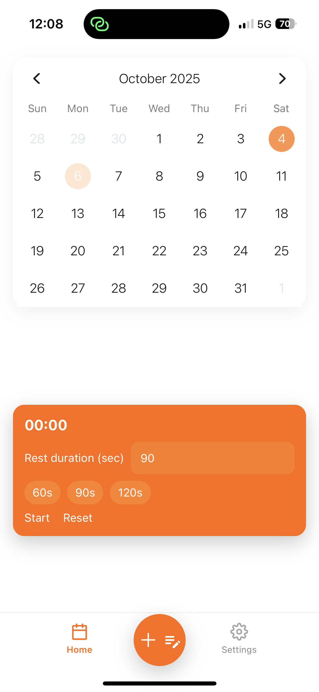
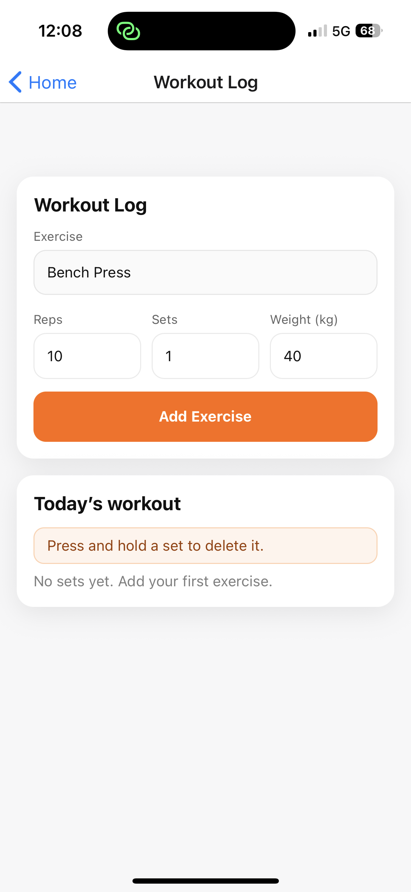
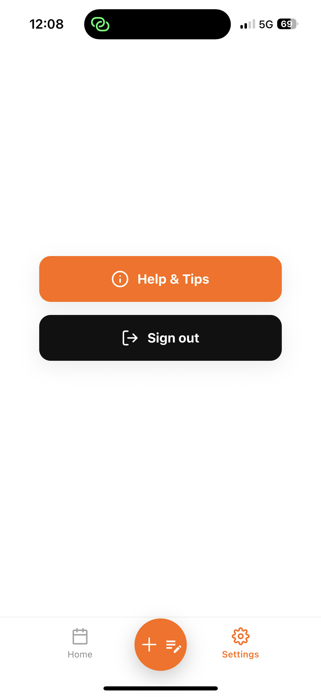

# GymLog (React Native + Supabase)

A simple, fast workout log for iOS/Android. Start a workout, add sets (reps × weight), and review your training on a calendar.

> Built with Expo, React Navigation, and Supabase. Focused on clarity, reliability, and small, deliberate code.

---

## Features

- 🗓️ **Calendar view** — marks days you trained; tap any day to review that date.
- ✍️ **Workout log** — choose an exercise, add sets (reps/weight). Groups by exercise.
- 🔁 **Quick add** — duplicate last set for speed.
- ⏱️ **Rest timer** — presets + local notifications.
- 🗑️ **Edit safety** — long-press a set to delete (with confirmation).
- 🔐 **Auth** — sign up / login with Supabase.
- 📱 **Polished UI** — simple cards, consistent theme tokens.

---

## Screenshots

  
  
  

---
